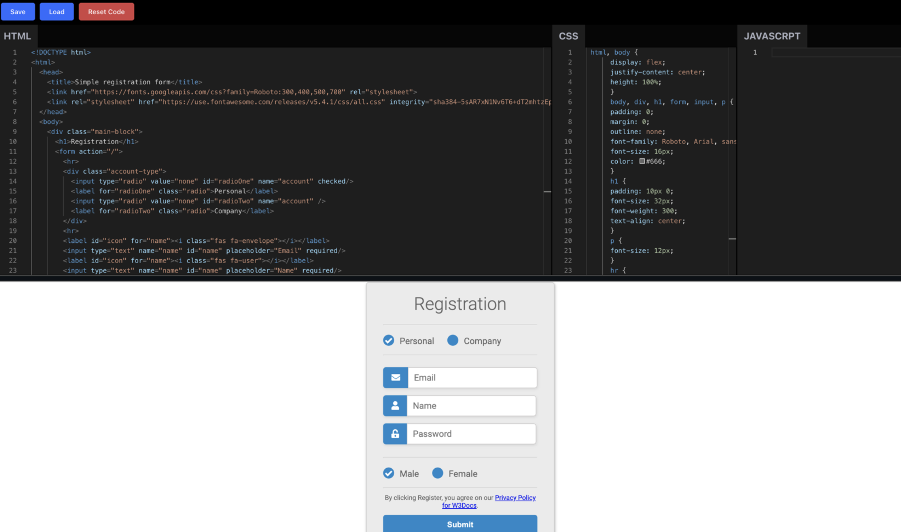

# Simple Codepen clone using React

This project was bootstrapped with [Create React App](https://github.com/facebook/create-react-app).

## Tooling

- [React](https://reactjs.org/)
- [Evergree UI](https://evergreen.segment.com/)
- [Monaco editor](https://github.com/suren-atoyan/monaco-react)

### Features

- codepen can be saved and loaded from local storage.
- reset the code to empty state.
- syntax highlighting for HTML, CSS and JS.
- live preview of the codepen.

### Screenshots

